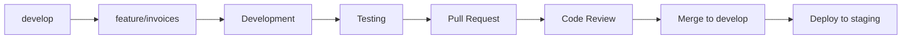
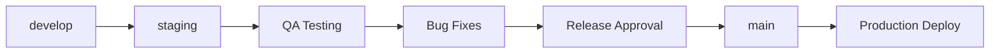
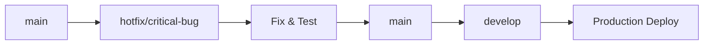

# YukiMart - Git Workflow

## 📋 Tổng quan quy trình Git

YukiMart sử dụng **Feature Branch Workflow** với **Pull Request** để đảm bảo chất lượng code và collaboration hiệu quả.

## 🌳 Branching Strategy

### Main Branches
```
main (production)
├── develop (integration)
├── staging (pre-production)
└── feature/* (feature development)
```

### Branch Types

#### 1. Main Branch
- **Purpose**: Production-ready code
- **Protection**: Protected, requires PR approval
- **Deployment**: Auto-deploy to production
- **Naming**: `main`

#### 2. Develop Branch
- **Purpose**: Integration branch for features
- **Protection**: Protected, requires PR approval
- **Testing**: Automated testing required
- **Naming**: `develop`

#### 3. Feature Branches
- **Purpose**: Individual feature development
- **Lifetime**: Short-lived (1-2 weeks max)
- **Source**: Created from `develop`
- **Naming**: `feature/[module-name]` or `feature/[issue-number]`

#### 4. Hotfix Branches
- **Purpose**: Critical production fixes
- **Source**: Created from `main`
- **Target**: Merge to both `main` and `develop`
- **Naming**: `hotfix/[issue-description]`

## 🔄 Workflow Process

### 1. Feature Development Workflow



#### Step-by-step Process:

1. **Create Feature Branch**
   ```bash
   git checkout develop
   git pull origin develop
   git checkout -b feature/invoices
   ```

2. **Development**
   ```bash
   # Make changes
   git add .
   git commit -m "feat: add invoice checkbox functionality"
   git push origin feature/invoices
   ```

3. **Create Pull Request**
   - Target: `develop` branch
   - Include: Description, screenshots, testing notes
   - Assign: Reviewers

4. **Code Review & Merge**
   - Review approval required
   - All tests must pass
   - Merge to `develop`

### 2. Release Workflow



#### Release Process:

1. **Prepare Release**
   ```bash
   git checkout develop
   git pull origin develop
   git checkout staging
   git merge develop
   git push origin staging
   ```

2. **QA Testing**
   - Deploy to staging environment
   - Comprehensive testing
   - Bug fixes if needed

3. **Production Release**
   ```bash
   git checkout main
   git merge staging
   git tag v1.0.0
   git push origin main --tags
   ```

### 3. Hotfix Workflow



#### Hotfix Process:

1. **Create Hotfix Branch**
   ```bash
   git checkout main
   git pull origin main
   git checkout -b hotfix/payment-error
   ```

2. **Fix & Test**
   ```bash
   # Make critical fix
   git add .
   git commit -m "fix: resolve payment processing error"
   git push origin hotfix/payment-error
   ```

3. **Merge to Main & Develop**
   ```bash
   # Merge to main
   git checkout main
   git merge hotfix/payment-error
   git push origin main
   
   # Merge to develop
   git checkout develop
   git merge hotfix/payment-error
   git push origin develop
   ```

## 📝 Commit Message Convention

### Format
```
<type>(<scope>): <subject>

<body>

<footer>
```

### Types
- **feat**: New feature
- **fix**: Bug fix
- **docs**: Documentation changes
- **style**: Code style changes (formatting, etc.)
- **refactor**: Code refactoring
- **test**: Adding or updating tests
- **chore**: Maintenance tasks

### Examples
```bash
feat(invoices): add bulk actions for invoice management

- Add checkbox functionality for row selection
- Implement bulk update delivery status
- Add bulk cancel functionality
- Include SweetAlert confirmations

Closes #123
```

```bash
fix(products): resolve barcode scanning issue

- Fix barcode input validation
- Update product search logic
- Add error handling for invalid barcodes

Fixes #456
```

## 🔍 Code Review Guidelines

### Review Checklist

#### ✅ Code Quality
- [ ] Code follows project coding standards
- [ ] No code duplication
- [ ] Proper error handling
- [ ] Security considerations addressed
- [ ] Performance implications considered

#### ✅ Functionality
- [ ] Feature works as expected
- [ ] Edge cases handled
- [ ] User experience is intuitive
- [ ] Mobile responsiveness (if applicable)

#### ✅ Testing
- [ ] Unit tests included
- [ ] Integration tests pass
- [ ] Manual testing completed
- [ ] No breaking changes

#### ✅ Documentation
- [ ] Code is well-commented
- [ ] README updated (if needed)
- [ ] API documentation updated
- [ ] Database changes documented

### Review Process

1. **Automated Checks**
   - Code style validation
   - Unit tests execution
   - Security scanning
   - Performance testing

2. **Manual Review**
   - Code logic review
   - Architecture compliance
   - Business logic validation
   - UI/UX review

3. **Approval & Merge**
   - At least 1 approval required
   - All checks must pass
   - Squash and merge preferred

## 🚀 Deployment Process

### Environments

#### 1. Development
- **Branch**: `feature/*`
- **URL**: `http://yukimart.local/`
- **Purpose**: Local development
- **Database**: Local MySQL

#### 2. Staging
- **Branch**: `staging`
- **URL**: `https://staging.yukimart.com/`
- **Purpose**: QA testing
- **Database**: Staging database

#### 3. Production
- **Branch**: `main`
- **URL**: `https://yukimart.com/`
- **Purpose**: Live system
- **Database**: Production database

### Deployment Pipeline

```yaml
# .github/workflows/deploy.yml
name: Deploy

on:
  push:
    branches: [main, staging, develop]

jobs:
  deploy:
    runs-on: ubuntu-latest
    steps:
      - uses: actions/checkout@v2
      - name: Setup PHP
        uses: shivammathur/setup-php@v2
        with:
          php-version: 8.3
      - name: Install dependencies
        run: composer install --no-dev --optimize-autoloader
      - name: Run tests
        run: php artisan test
      - name: Deploy to server
        run: ./deploy.sh
```

## 🛠️ Development Setup

### Initial Setup
```bash
# Clone repository
git clone git@github.com:briansamuel/yukimart.git
cd yukimart

# Install dependencies
composer install
npm install

# Environment setup
cp .env.example .env
php artisan key:generate

# Database setup
php artisan migrate
php artisan db:seed

# Start development server
php artisan serve
```

### Daily Development
```bash
# Start work
git checkout develop
git pull origin develop
git checkout -b feature/new-feature

# During development
git add .
git commit -m "feat: implement new feature"
git push origin feature/new-feature

# End of day
git push origin feature/new-feature
```

## 📊 Branch Management

### Branch Naming Conventions

#### Feature Branches
- `feature/invoices` - Invoice system features
- `feature/products` - Product management features
- `feature/orders` - Order processing features
- `feature/customers` - Customer management features

#### Bug Fix Branches
- `bugfix/invoice-calculation` - Bug fixes
- `bugfix/product-search` - Search issues

#### Hotfix Branches
- `hotfix/payment-gateway` - Critical production fixes
- `hotfix/security-patch` - Security issues

### Branch Cleanup

#### Regular Cleanup
```bash
# Delete merged feature branches
git branch --merged develop | grep -v develop | xargs git branch -d

# Delete remote tracking branches
git remote prune origin
```

#### Automated Cleanup
- Feature branches auto-deleted after merge
- Stale branches identified weekly
- Notification to developers for cleanup

## 🔒 Security & Compliance

### Security Checks
- **SAST**: Static Application Security Testing
- **Dependency Scanning**: Vulnerable package detection
- **Secret Scanning**: Credential leak prevention
- **License Compliance**: Open source license checking

### Compliance Requirements
- All commits must be signed
- No direct pushes to protected branches
- Required status checks before merge
- Branch protection rules enforced

---

**Last Updated**: January 2025  
**Version**: 1.0.0  
**Maintainer**: Development Team
